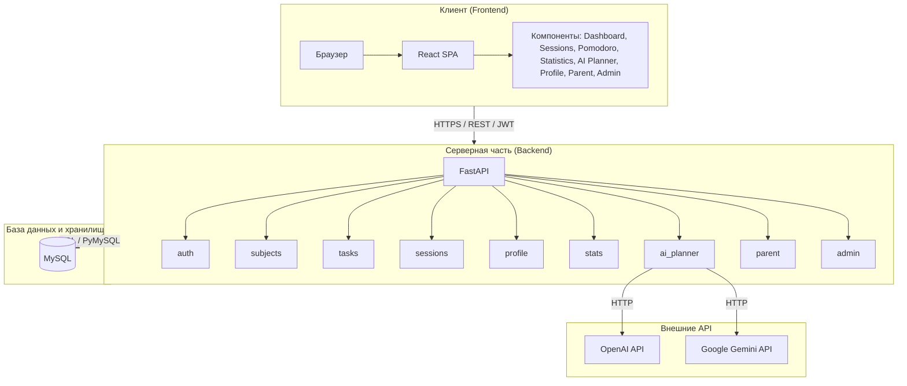

# Studly — Документация проекта

## 2. Введение

### 2.1 Описание предметной области

**Studly** — веб-приложение для организации и отслеживания учебной деятельности. Система объединяет планирование занятий, тайм-менеджмент по методу Pomodoro, визуализацию статистики и поддержку нескольких ролей пользователей (ученик, родитель, учитель, администратор).

### 2.2 Назначение

Приложение предназначено для:
- планирования учебных сессий по предметам;
- проведения занятий с таймером Pomodoro (интервалы работа/перерыв);
- ведения задач по предметам и отслеживания их выполнения;
- анализа продуктивности и визуализации статистики;
- генерации рекомендаций и тестов для закрепления материала с помощью ИИ (OpenAI/Gemini);
- контроля родителями/учителями успеваемости учеников.

### 2.3 Целевая аудитория

- **Ученики** — школьники и студенты, планирующие самостоятельную учёбу.
- **Родители** — контроль прогресса детей, создание сессий для ребёнка, просмотр статистики.
- **Учителя** — организация учебного процесса, работа с классами.
- **Администраторы** — управление пользователями и общая аналитика.

### 2.4 Актуальность

Необходимость в инструментах планирования и самоконтроля учёбы растёт: современные учащиеся используют множество источников информации и часто испытывают сложности с концентрацией и распределением времени. Studly объединяет метод Pomodoro, визуализацию прогресса и ИИ-поддержку в едином интерфейсе.

### 2.5 Цель проектирования

Разработать веб-приложение для планирования и отслеживания учебной деятельности с ролевой моделью, таймером Pomodoro, статистикой и ИИ-функциями.

### 2.6 Задачи проектирования

1. Проектирование архитектуры клиент-серверного приложения.
2. Разработка REST API для всех сущностей (пользователи, предметы, задачи, сессии, статистика).
3. Реализация аутентификации и авторизации (JWT, роли).
4. Реализация Pomodoro-таймера и логики сессий.
5. Интеграция внешних ИИ-API (OpenAI, Gemini) для генерации планов и тестов.
6. Реализация кабинета родителя с привязкой детей и просмотром их статистики.
7. Реализация панели администратора.
8. Разработка адаптивного пользовательского интерфейса.

---

## 3. Постановка задачи

### 3.1 Функциональные требования

| № | Требование | Описание |
|---|------------|----------|
| FR-1 | Регистрация и вход | Регистрация с выбором роли, вход по email/паролю, JWT-токен |
| FR-2 | Управление предметами | Создание, редактирование, удаление предметов с категориями и цветами |
| FR-3 | Управление задачами | CRUD задач по предметам, приоритеты, отметка выполнения |
| FR-4 | Сессии | Создание сессий с целью, предметом, интервалами Pomodoro, планирование по дате/времени |
| FR-5 | Pomodoro-таймер | Таймер работа/перерыв, завершение сессии, запись в БД |
| FR-6 | Статистика | Дневная/недельная статистика, время по предметам, streak, графики |
| FR-7 | AI-планировщик | Генерация персональных рекомендаций по продуктивности |
| FR-8 | AI-тесты | Генерация вопросов для закрепления материала после сессии |
| FR-9 | Профиль | Обновление имени, темы, пригласительный код |
| FR-10 | Кабинет родителя | Привязка детей по коду, просмотр их сессий и статистики, создание сессий для детей |
| FR-11 | Панель администратора | Список пользователей, фильтр по ролям, сводная статистика |
| FR-12 | Цитаты | Мотивирующие цитаты на основе лучшего предмета пользователя |

### 3.2 Нефункциональные требования

| № | Требование | Описание |
|---|------------|----------|
| NFR-1 | Безопасность | Хеширование паролей (bcrypt), JWT, защита маршрутов по ролям |
| NFR-2 | Производительность | Быстрый отклик API (<500 мс для типичных запросов) |
| NFR-3 | Масштабируемость | Разделение фронтенда и бэкенда, возможность горизонтального масштабирования |
| NFR-4 | Совместимость | Поддержка современных браузеров, адаптивный интерфейс |
| NFR-5 | Надёжность | Транзакционность БД, обработка ошибок, логирование |

### 3.3 Ограничения

- Использование технологий: Python (бэкенд), React (фронтенд), MySQL (БД).
- ИИ-функции требуют API-ключей OpenAI и/или Gemini (опционально, есть моковые данные).
- Однопользовательская БД на одном сервере в базовой конфигурации.

### 3.4 Ожидаемые результаты

- Рабочее веб-приложение с полным набором заявленных функций.
- REST API, документированный и устойчивый к ошибкам.
- Понятный и удобный интерфейс для всех ролей.
- Возможность развёртывания в production-среде.

---

## 4. Архитектура веб-приложения

### 4.1 Выбранная архитектурная модель

**Трёхуровневая клиент-серверная архитектура (3-Tier):**
- **Уровень представления (Presentation)** — одностраничное приложение (SPA) на React.
- **Уровень бизнес-логики (Application)** — REST API на FastAPI.
- **Уровень данных (Data)** — реляционная СУБД MySQL.

### 4.2 Аргументация выбора

| Критерий | Выбранный подход | Альтернативы | Преимущества выбора |
|----------|------------------|--------------|---------------------|
| Фронтенд | React SPA | Vue, Angular, SSR (Next.js) | Широкое сообщество, компонентная модель, быстрая разработка |
| Бэкенд | FastAPI | Flask, Django, Node.js | Асинхронность, автоматическая OpenAPI-документация, валидация Pydantic |
| БД | MySQL | PostgreSQL, MongoDB | Надёжность, ACID, знакомство, подходит для структурированных данных |
| Архитектура | REST API | GraphQL, gRPC | Простота, кэширование, совместимость с любым клиентом |

**Масштабируемость:** Разделение фронтенда и бэкенда позволяет масштабировать их независимо; можно вынести API за балансировщик нагрузки.

**Безопасность:** JWT для stateless-аутентификации, CORS-настройки, разделение ролей на уровне API и UI.

**Производительность:** Асинхронные обработчики FastAPI, индексы в БД, минимизация количества запросов.

**Сложность разработки:** Понятный стек, обилие готовых библиотек, быстрый старт.

### 4.3 Описание компонентов

#### Бэкенд (FastAPI)

| Модуль | Назначение | Основные эндпоинты |
|--------|------------|--------------------|
| `auth` | Аутентификация | POST /api/auth/register, /api/auth/login |
| `subjects` | Предметы | CRUD /api/subjects |
| `tasks` | Задачи | CRUD /api/tasks, /api/tasks/subject/{id} |
| `sessions` | Сессии | CRUD /api/sessions, GET /api/sessions/{id} |
| `profile` | Профиль | GET/PUT /api/profile, /api/profile/invite-code |
| `stats` | Статистика | GET /api/stats/dashboard, weekly, subjects, quote |
| `activity_zones` | Зоны продуктивности | GET /api/activity-zones |
| `ai_planner` | ИИ-планировщик | POST /api/ai/generate-plan, /api/ai/generate-test |
| `parent` | Кабинет родителя | GET /api/parent/children, POST /api/parent/children/link, CRUD сессий для детей |
| `admin` | Панель администратора | GET /api/admin/users, /api/admin/stats |
| `achievements` | Достижения | GET /api/achievements |
| `goals` | Цели | CRUD /api/goals |

#### Фронтенд (React)

| Модуль | Назначение |
|--------|------------|
| `LoginPage`, `RegisterPage` | Вход и регистрация |
| `Dashboard` | Главная: приветствие, статистика, недавние сессии, график |
| `SubjectsPage` | Предметы и задачи |
| `SessionPlanningPage` | Планирование сессий, список «Мои сессии» |
| `PomodoroTimer` | Таймер Pomodoro, модалка завершения, AI-чат для тестов |
| `SessionCompletePage` | Страница после завершения сессии, закрепление |
| `StatisticsPage` | Аналитика, графики, цитаты |
| `AIPlannerPage` | AI-планировщик, зоны продуктивности, применение предложений |
| `ProfilePage` | Профиль, тема, пригласительный код |
| `ParentCabinetPage` | Кабинет родителя: дети, статистика, создание сессий |
| `AdminPanelPage` | Список пользователей, статистика |
| `ProtectedRoute`, `RoleProtectedRoute` | Защита маршрутов по ролям |

#### База данных (MySQL)

| Таблица | Назначение |
|---------|------------|
| `users` | Пользователи, роли, пригласительные коды |
| `subjects` | Предметы пользователей |
| `tasks` | Задачи по предметам |
| `study_sessions` | Сессии с параметрами Pomodoro |
| `pomodoro_intervals` | Интервалы работы/перерывов |
| `study_time_logs` | Агрегированная статистика по дням |
| `activity_zones` | Зоны продуктивности по времени |
| `achievements`, `user_achievements` | Достижения |
| `goals` | Цели |
| `invitations` | Приглашения родитель-ученик |
| `parent_child_links` | Связи родитель — ребёнок |

#### Внешние сервисы

- **OpenAI API** — генерация рекомендаций и тестов (опционально).
- **Google Gemini API** — альтернатива OpenAI (опционально).

---

## 5. Структурная схема приложения

Ниже приведена структурная схема в формате Mermaid. Её можно отобразить в любом редакторе, поддерживающем Mermaid (GitHub, VS Code с расширением, draw.io и др.).

### 5.1 Направления потоков данных

1. **Аутентификация:**  
   Клиент → POST /api/auth/login → Сервер → проверка пароля в БД → JWT → Клиент (сохранение в localStorage).

2. **Сессии:**  
   Клиент → GET/POST /api/sessions → Сервер → MySQL (study_sessions) → JSON → Клиент.

3. **Статистика:**  
   Клиент → GET /api/stats/dashboard, weekly, subjects → Сервер → агрегация из study_time_logs, study_sessions → JSON → Клиент.

4. **ИИ-генерация:**  
   Клиент → POST /api/ai/generate-test → Сервер → OpenAI/Gemini API → ответ → Клиент.

5. **Родитель — ребёнок:**  
   Родитель создаёт код → Ученик вводит код → Сервер создаёт связь в parent_child_links → Родитель получает доступ к данным ребёнка через /api/parent/children/{id}/stats.

---

## 6. Макет пользовательского интерфейса

### 6.1 Набор экранов

| Экран | Маршрут | Назначение | Ключевые элементы |
|-------|---------|------------|-------------------|
| **Лендинг** | `/` | Публичная главная | Hero-секция, «О нас», «Почему мы», «Как работает», CTA «Присоединиться» |
| **Регистрация** | `/register` | Регистрация нового пользователя | Двухшаговая форма: email/пароль, выбор роли (Взрослый, Школьник, Родитель) |
| **Вход** | `/login` | Аутентификация | Email, пароль, ссылка на регистрацию |
| **Главная (Dashboard)** | `/dashboard` | Обзор для ученика/учителя | Приветствие, карточки статистики (время, задачи, сессии, streak), недавние сессии, график динамики, календарь |
| **Предметы** | `/subjects` | Предметы и задачи | Карточки предметов, добавление предмета, задачи с чекбоксами, фильтр по категориям |
| **Мои сессии** | `/sessions` | Планирование сессий | Форма создания (цель, предмет, интервалы), сетка карточек сессий, модалка планирования по календарю |
| **Pomodoro-таймер** | `/pomodoro` | Таймер занятия | Круглый таймер, кнопки Старт/Пауза/Сброс/Завершить, счётчик интервалов |
| **Модалка завершения** | (в Pomodoro) | Выбор после сессии | Статистика сессии, кнопки «Посмотреть статистику» и «Закрепить» |
| **AI-чат (тесты)** | (модалка в Pomodoro) | Закрепление материалa | Чат с ИИ, генерация вопросов по теме сессии |
| **Сессия завершена** | `/session-complete` | Итоги и закрепление | Вкладки «Аналитика» и «Закрепление», генерация теста, кнопки «Новая сессия», «На главную» |
| **Статистика** | `/statistics` | Аналитика учёбы | Карточки (streak, часы, задачи), вкладки «Календарь», «Статистика», «Предметы», «Рост», цитата |
| **AI-планировщик** | `/ai-planner` | Рекомендации ИИ | Кнопка «Создать план», блок анализа продуктивности, зоны продуктивности, карточки предложений с кнопкой «Применить» |
| **Профиль** | `/profile` | Настройки пользователя | Имя, тема, пригласительный код (для связи с родителем) |
| **Кабинет родителя** | `/parent` | Работа с детьми | Список детей, привязка по коду, статистика ребёнка, создание сессии для ребёнка |
| **Панель администратора** | `/admin` | Администрирование | Карточки общей статистики, таблица пользователей, фильтр по ролям, поиск |
| **Приглашение ученика** | `/student-invitation` | Ввод кода от родителя | Форма ввода пригласительного кода |
| **Приглашение родителя** | `/parent-invitation` | Создание кода | Генерация и отображение кода для привязки ребёнка |
| **Страница ошибки 404** | `*` | Несуществующий путь | Сообщение «Страница не найдена», кнопка на главную |

### 6.2 Формы ввода

| Форма | Поля | Валидация | Действие |
|-------|------|-----------|----------|
| Регистрация (шаг 1) | Email, пароль | Email по маске, пароль ≥6 символов | Переход к выбору роли |
| Регистрация (шаг 2) | Роль | Обязательный выбор | Отправка на API, автовход |
| Вход | Email, пароль | Обязательные | POST /api/auth/login |
| Добавить предмет | Название, категория (цвет) | Обязательное название | POST /api/subjects |
| Добавить задачу | Название, приоритет | Обязательное название | POST /api/tasks |
| Создать сессию | Цель, предмет, интервалы (или пресеты), дата/время | Обязательные цель и предмет | POST /api/sessions |
| Привязать ребёнка | Пригласительный код | Непустой код | POST /api/parent/children/link |
| Профиль | Имя, тема | — | PUT /api/profile |
| Поиск (админ) | Текст, фильтр роли | — | Фильтрация списка |

### 6.3 Страницы ошибок

- **404 (NotFound404)** — для несуществующих маршрутов, ссылка на главную.
- **401/403** — при отсутствии или неверном токене: редирект на `/login`.
- **Ошибки API** — отображаются в баннерах/уведомлениях на соответствующих экранах (например, «Ошибка создания сессии»).

### 6.4 Используемые компоненты интерфейса

| Компонент | Назначение | Примеры использования |
|-----------|------------|------------------------|
| **Sidebar (боковая панель)** | Навигация по разделам | Dashboard, Subjects, Sessions, Statistics, AI Planner, Profile |
| **Карточки (cards)** | Группировка контента | Статистика, сессии, предметы, предложения ИИ |
| **Outline-кнопки** | Действия с акцентом без заливки | «Начать», «Закрепить», бейджи предметов |
| **Primary-кнопки** | Основные действия | «Войти», «Создать план», «Применить» |
| **Модальные окна** | Дополнительные сценарии | Завершение сессии, AI-чат, создание сессии для ребёнка, подтверждение удаления |
| **Выпадающие списки (select)** | Выбор варианта | Предмет, роль, интервалы — класс `studly-select` |
| **Бейджи** | Статусы и категории | «Запланировано», «Завершено», категория предмета |
| **SVG-иконки** | Визуальные подсказки | Lucide React (Clock, Target, Calendar, Play, Sparkles и др.) |
| **ConfirmModal** | Подтверждение опасных действий | Удаление предмета, отвязка ребёнка |

### 6.5 Логика навигации

- **Публичные маршруты:** `/`, `/login`, `/register`, `/student-invitation`, `/parent-invitation`.
- **Защищённые маршруты:** требуют JWT; при его отсутствии — редирект на `/login`.
- **Ролевая защита:**
  - `/dashboard`, `/subjects`, `/sessions`, `/pomodoro`, `/session-complete`, `/statistics`, `/achievements`, `/ai-planner` — для `student` и `teacher`;
  - `/parent` — только для `parent`;
  - `/admin` — только для `admin`;
  - `/profile` — для всех авторизованных.
- **Типичные переходы:**
  - Dashboard → «Новая сессия» → Sessions; «Статистика» → Statistics; карточка сессии «Начать» → Pomodoro;
  - Pomodoro (завершение) → модалка → «Закрепить» → AI-чат или «Статистика» → Statistics;
  - Pomodoro (все интервалы) → Session Complete → Dashboard/Sessions;
  - AI Planner → «Применить» на карточке → Sessions (создание сессий).

### 6.6 Принципы адаптивности

- **Breakpoints:** основной медиа-запрос `@media (max-width: 768px)` для мобильных устройств.
- **Адаптивные изменения:**
  - Sidebar: на узких экранах сокращается до иконок (скрывается текст пунктов);
  - Сетки карточек: переход на одну колонку (`grid-template-columns: 1fr`);
  - Формы и контейнеры: уменьшенные отступы (`padding`);
  - Кнопки: полная ширина (`width: 100%`) для удобства на тач-устройствах;
  - Заголовки и шапки: переключение на колоночную компоновку.
- **Единый дизайн:** шрифт Montserrat, цветовая схема с акцентом `#7012CE`, скругления 8–20px, мягкие тени.
- **Контейнеры:** `max-width` для форм (например, 360px), центрирование контента.

---

## Файл диаграммы

Диаграмма сохранена в формате Mermaid. Для экспорта в изображение можно использовать:
- [Mermaid Live Editor](https://mermaid.live/)
- Расширение Mermaid для VS Code
- `mermaid-cli` (mmdc) для генерации PNG/SVG
